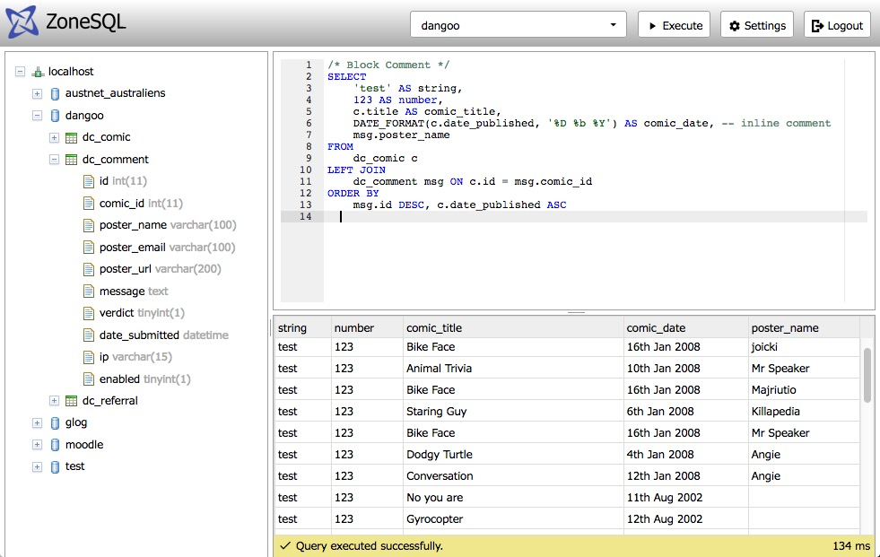

# ZoneSQL

## Overview

ZoneSQL is a web based database interface application allowing SQL access to a 
number of different database management systems including MySQL, Microsoft SQL 
Server and SQLite. With the convenience of a web based architecture, ZoneSQL 
provides a rich efficient interface with the familiar look and feel of some 
existing powerful software based DBMS tools. This provides an optimal platform 
for working with SQL and data. 

The UI provides resizable panels including a full tree view of the server,
databases and tables, a syntax highlighted SQL query entry window, and a fully 
featured rich dynamic grid output. The product is useful for setting up direct 
access to databases at remote sites via simple web based access. Security and 
authentication are configurable.

## Download and Installation

### Release
Download the latest release, pre-built, optimised and ready for use. Download and uncompress into a web accessible area, and then complete the [required settings](https://github.com/zonesql/zonesql/blob/master/README.md#configuration) in config.php. 

<a href="https://github.com/zonesql/zonesql.github.io/blob/master/zonesql-1.0.0.zip" id="download-zip" class="button" download>Download ZoneSQL 1.0.0 (zip)</a>

<a href="https://github.com/zonesql/zonesql.github.io/blob/master/zonesql-1.0.0.tar.gz" id="download-tar.gz" class="button" download>Download ZoneSQL 1.0.0 (tar.gz)</a>

### Download Source
Please see the github [README](https://github.com/zonesql/zonesql#download-source) for instructions how to quickly and easily download the source. Tools are also made available to build and compile your source to create your own release.

